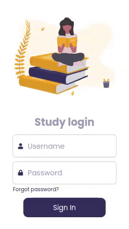

 

### Projeto Study plataform
Este é um projeto pessoal, que tem o intuíto de criar uma plataforma de estudos colaborativa, voltada para a área de tecnologia. As aulas serão feitas por voluntários e os alunos terão acesso gratuíto a plataforma.

A educação é um meio que vejo que posso contribuir para que o mundo se torne um lugar ainda melhor, com pessoas realizadas em si e plenas para também poderem fazer a diferença num mundo tantas vezes egoísta e desigual.

<h5> Framework/Linguagens </h5>

 
 
 
 

<h5>Principais dependências </h5>

 
 
 
 

